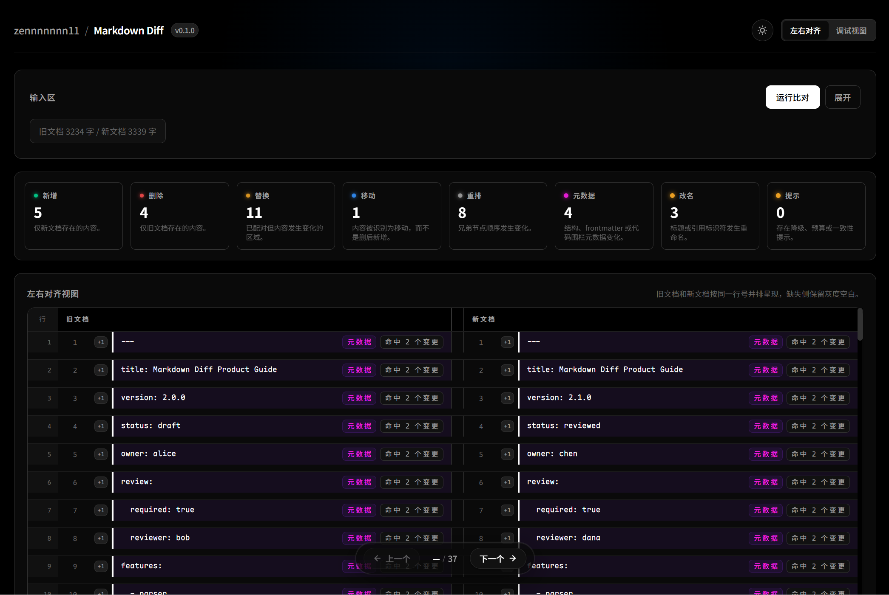

# Markdown Diff

结构感知的 Markdown 差异分析工具。当前项目形态是一个在线单页 diff 工作台：基于语义树比对而非逐行文本 diff，能够识别移动、重命名、重排序等高层变更，并提供行级 / 词级 / 字符级三层精度的 inline 差异高亮。

## 在线演示

- Demo: https://diff.nezz.ccwu.cc/

## 截图

### 浅色模式


### 深色模式



## 特性亮点

**7 种变更类型检测**

| 类型 | 说明 | 示例 |
|------|------|------|
| Insert | 新增内容 | 新增段落、代码块、表格行 |
| Delete | 删除内容 | 移除章节、列表项 |
| Replace | 内容修改 | 段落文字编辑、代码变更 |
| Move | 内容迁移 | 章节在文档中移动位置 |
| Rename | 标识符更名 | 标题改名（保留正文）、脚注标识符变更 |
| Reorder | 同级重排 | 兄弟章节交换顺序 |
| Meta-update | 元数据变更 | Frontmatter 字段、代码块语言、表格对齐、复选框状态 |

**核心能力**

- **四阶段流水线** — Parser → Transformer → Diff Engine → Projection
- **多层哈希索引** — 每个节点 7 种签名（self / direct / subtree / identity / contentOnly / headingBody / path），支撑从精确到模糊的匹配层级
- **SimHash 局部敏感哈希** — 基于 Charikar SimHash + MinHash 的快速相似度召回，避免 O(n²) 全量比较
- **三种序列对齐算法** — Myers / Heckel / Histogram 自动选择
- **最优匹配** — Hungarian（Kuhn-Munkres）O(n³) 二分匹配 + APTED 树编辑距离后备
- **Rust→WASM 加速** — Myers diff / Hungarian / SimHash / MinHash 编译为 WebAssembly，JS 回退兜底
- **Web Worker 执行** — diff 计算在后台线程运行，不阻塞 UI
- **Frontmatter 深度 diff** — YAML / TOML 逐键对比
- **行 / 词 / 字符三层 inline diff** — 段落词级、标题词级、代码块字符级

**交互与视觉**

- CodeMirror 6 编辑器 + Markdown 语法高亮
- 三种视图模式：左右对齐 / 单侧源码 / 调试视图
- `@tanstack/vue-virtual` 虚拟滚动
- 变更导航（Alt+↑/↓ 快捷键）
- 点击变更行打开详情弹窗（含匹配证据、相似度、inline diff）
- Vercel/Geist 设计语言 + 毛玻璃效果 + 弹性微交互

## 快速开始

### 前置要求

- Node.js `^20.19.0 || >=22.12.0`
- pnpm

### 安装与启动

```bash
# 克隆仓库
git clone <repository-url>
cd markdowndiff2

# 安装依赖
pnpm install

# 启动开发服务器
pnpm dev
```

浏览器打开 `http://localhost:5173`，页面会加载内置的示例文档并自动执行一次 diff。

也可以直接访问在线演示：<https://diff.nezz.ccwu.cc/>

### 生产构建

```bash
# 类型检查 + 构建（并行）
pnpm build

# 预览构建产物
pnpm preview
```

## 使用方式

1. 在左右两个编辑器中粘贴（或导入）旧文档和新文档
2. 点击 **运行比对**（或修改内容后重新比对）
3. 查看结果：
   - **统计栏** — 各类型变更计数，点击可定位到首个匹配
   - **左右对齐视图** — 旧/新文档逐行并排，缺失侧显示灰色占位
   - **单侧源码视图** — 两个独立滚动面板（同步滚动），完整源码 + 变更叠加
   - **调试视图** — DiffResult 原始 JSON 检查
4. 点击任何变更行打开详情弹窗，查看匹配证据和 inline diff
5. 使用 `Alt+↑` / `Alt+↓` 在变更之间快速跳转

## 架构概览

```
                    ┌──────────────────────────────────────────────────┐
                    │                  Markdown Diff                   │
                    └──────────────────────────────────────────────────┘

  ┌─────────────┐     ┌──────────────┐     ┌──────────────┐     ┌──────────────┐
  │   Parser    │────▶│ Transformer  │────▶│ Diff Engine  │────▶│  Projection  │
  │             │     │              │     │              │     │              │
  │ Markdown    │     │ mdast AST    │     │ Section Tree │     │ DiffResult   │
  │    ↓        │     │    ↓         │     │    ↓         │     │    ↓         │
  │ mdast AST   │     │ Section Tree │     │ DiffResult   │     │ View Model   │
  └─────────────┘     └──────────────┘     └──────────────┘     └──────────────┘
    remark-parse        层级 Section         确定性匹配            逐行投射
    remark-gfm          递归嵌套             递归对齐              tone 着色
    remark-math         块 / 内联分离        移动恢复              inline 分段
    remark-frontmatter  ID 生成              重命名检测            annotation
    remark-directive                         内联 diff             虚拟滚动
```

### 阶段 1：Parser

基于 [unified](https://github.com/unifiedjs/unified) + [remark](https://github.com/remarkjs/remark) 生态。插件链：

```
remark-parse → remark-frontmatter → remark-gfm → remark-math → remark-directive → remark-heading-id
```

支持 GFM（表格、删除线、自动链接、任务列表）、YAML/TOML frontmatter、LaTeX 数学公式、指令语法、自定义标题 ID。

### 阶段 2：Transformer

将扁平 mdast AST 转换为层级 **Section 树**。Section 类型包括 `root` / `heading` / `frontmatter` / `listItem` / `blockquote` / `footnote`，每个 Section 包含子 Block 节点和嵌套 Section。标题按层级自动嵌套（`## Foo` 成为 `# Bar` 的子节点）。

### 阶段 3：Diff Engine

核心比对引擎，执行流程：

1. **语义索引构建** — 为每个节点生成 7 种哈希签名，构建多维查找表
2. **确定性匹配** — 精确 subtree / self / direct 哈希匹配 + 锚点注册（位置单调约束）
3. **递归对齐** — 序列对齐 + Hungarian 最优间隙配对 + 子树递归
4. **局部匹配** — SimHash 预筛 + Jaccard/序列相似度 + 唯一性边距检查
5. **移动恢复** — 检测 delete+insert 对中的内容迁移（exact / direct / heading / code 四种子策略）
6. **重命名和元数据恢复** — 标题改名、脚注标识符变更、代码块属性变更、表格结构变更
7. **表示层 diff** — 段落词级 / 代码行级+字符级 / 表格单元格级 inline diff
8. **结构后备（APTED）** — 对齐失败时使用树编辑距离恢复

### 阶段 4：Projection

将 DiffResult 变更树映射回源码行号，生成 `ProjectionLine[]` 视图模型。每行包含主色调（tone）、inline 分段、annotation 标签、告警徽章、移动对端行号等信息，供 UI 组件直接渲染。

## 项目结构

```
markdowndiff2/
├── src/
│   ├── core/
│   │   ├── parser/            # 阶段 1：Markdown → mdast AST
│   │   ├── transformer/       # 阶段 2：mdast AST → Section Tree
│   │   ├── diff/              # 阶段 3：Diff Engine（项目核心）
│   │   │   ├── engine/        #   确定性匹配、递归对齐、移动恢复、
│   │   │   │                  #   重命名检测、内联 diff、结构后备
│   │   │   ├── __tests__/     #   核心 diff 测试
│   │   │   ├── sequence.ts    #   Myers / Heckel / Histogram 序列对齐
│   │   │   ├── similarity.ts  #   节点相似度评分（按类型加权）
│   │   │   ├── hungarian.ts   #   Kuhn-Munkres 最优二分匹配
│   │   │   ├── apted.ts       #   All Path Tree Edit Distance
│   │   │   ├── indexer.ts     #   语义索引构建
│   │   │   ├── heuristics.ts  #   ~50 个可调参数
│   │   │   └── worker-client.ts  # Web Worker 客户端
│   │   └── io/                # 文件读取
│   ├── features/
│   │   └── diff-workbench/    # 阶段 4 + 单页工作台 UI
│   │       ├── components/    #   8 个 Vue 组件
│   │       ├── view-model/    #   投射、合并行、分段、标签、详情
│   │       └── __tests__/     #   UI / 视图模型测试
│   ├── style.css              # Vercel/Geist 设计 token
│   └── main.ts                # 入口
├── tools/
│   ├── diff-wasm/             # Rust：Myers diff + Hungarian WASM
│   └── simhash-wasm/          # Rust：SimHash + MinHash WASM
├── e2e/                       # Playwright E2E 测试（11 个 spec）
├── old.md / new.md            # 内置示例文档
└── docs/                      # 文档
```

## Diff 引擎技术细节

### 多层哈希索引

每个节点生成 7 种哈希签名（xxHash-128），服务于不同匹配策略：

| 签名 | 用途 |
|------|------|
| `selfHash` | 节点自身结构（类型 + 标题 + 属性） |
| `directHash` | selfHash + 子节点 selfHash |
| `subtreeHash` | selfHash + 子节点 subtreeHash（深度递归） |
| `identityHash` | 脚注/定义的内容哈希 |
| `contentOnlyHash` | 纯文本内容哈希 |
| `headingBodyHash` | 标题正文内容（排除标题文字） |
| `pathHash` | 标题路径哈希（如 "Guide > Architecture > Pipeline"） |

另有 `textSimHash`（Charikar SimHash）用于局部敏感哈希召回。

### 序列对齐策略

引擎实现三种算法并根据输入特征自动选择：

- **Myers diff** — O((N+M)·D)，短序列或低编辑距离时最优
- **Heckel diff** — 适合高唯一 token 比例的序列，锚点 + LIS + 间隙 Myers
- **Histogram diff** — 围绕最稀有共享元素递归分治

选择逻辑基于 `shortSequenceThreshold`、`maxQuadraticSequenceCost`、`heckelUniqueRatio` 等参数。

### 移动恢复

标准 diff 会将移动的内容报告为"删除 + 新增"。引擎在初始比对后执行专门的移动恢复：

- **move-exact** — 未配对 delete/insert 间的唯一 subtreeHash 匹配
- **move-direct** — directHash 匹配 + 邻居上下文或兼容标题路径验证
- **move-heading** — 标题 slug 匹配 + 强正文相似度 + 唯一性
- **move-code** — contentOnlyHash 相同的代码块

### WASM 加速

两个 Rust 编译的 WebAssembly 模块，以 base64 嵌入生成的 TypeScript 文件：

| 模块 | 加速内容 |
|------|----------|
| `diff-wasm` | Myers diff、Hungarian 二分匹配 |
| `simhash-wasm` | SimHash 计算、MinHash 相似度估算、批量 Hamming 距离 |

均提供 JavaScript 回退，WASM 加载失败时自动降级。

### 预算与降级

引擎配置了多个成本预算（`maxLocalAlignmentCost`、`maxRecursiveAlignmentCost`、`maxInlineDiffMatrixCost`、`maxAptedCost`）。超出预算时优雅降级，标记区域为 degraded 而非产出低质量结果。

## 技术栈

### 运行时

| 依赖 | 用途 |
|------|------|
| Vue 3 | UI 框架 |
| CodeMirror 6 | Markdown 编辑器 |
| @tanstack/vue-virtual | 虚拟滚动 |
| unified / remark-* | Markdown 解析 |
| hash-wasm | xxHash-128 哈希 |
| yaml | YAML frontmatter 解析 |
| js-toml | TOML frontmatter 解析 |

### 开发

| 工具 | 用途 |
|------|------|
| Vite 8 | 构建工具 |
| TypeScript 6 | 类型系统 |
| Vitest 4 | 单元测试 |
| Playwright | E2E 测试 |
| ESLint + oxlint + Prettier | 代码质量 |
| vue-tsc | Vue 类型检查 |
| Rust / Cargo | WASM 模块编译 |
| Wrangler / Cloudflare | 本地预览与部署 |

## 测试

```bash
# 单元测试
pnpm test:unit

# 带覆盖率
pnpm vitest run --coverage

# E2E 测试
pnpm test:e2e

# 仅 Chromium
pnpm exec playwright test --project=chromium

# 类型检查
pnpm type-check
```

测试覆盖范围：

- 核心 diff 算法（确定性匹配、序列对齐、移动恢复、相似度计算、Hungarian、APTED）
- 边界条件和退化场景
- 特性交互矩阵
- 阈值边界验证
- Vue 组件行为
- 完整 E2E 用户流程（输入、比对、视图切换、详情弹窗、导航、无障碍）

> 注：测试规模会持续变化，以上命令与覆盖范围比固定数字更可信。

## 可用脚本

| 命令 | 说明 |
|------|------|
| `pnpm dev` | 启动 Vite 开发服务器 |
| `pnpm build` | 类型检查 + 生产构建（并行） |
| `pnpm preview` | 使用 Wrangler 本地预览构建产物 |
| `pnpm test:unit` | 运行 Vitest 单元测试 |
| `pnpm test:e2e` | 运行 Playwright E2E 测试 |
| `pnpm type-check` | vue-tsc 类型检查 |
| `pnpm lint` | oxlint + ESLint 代码检查 |
| `pnpm format` | Prettier 格式化 |
| `pnpm deploy` | 部署到 Cloudflare |

## License

MIT
